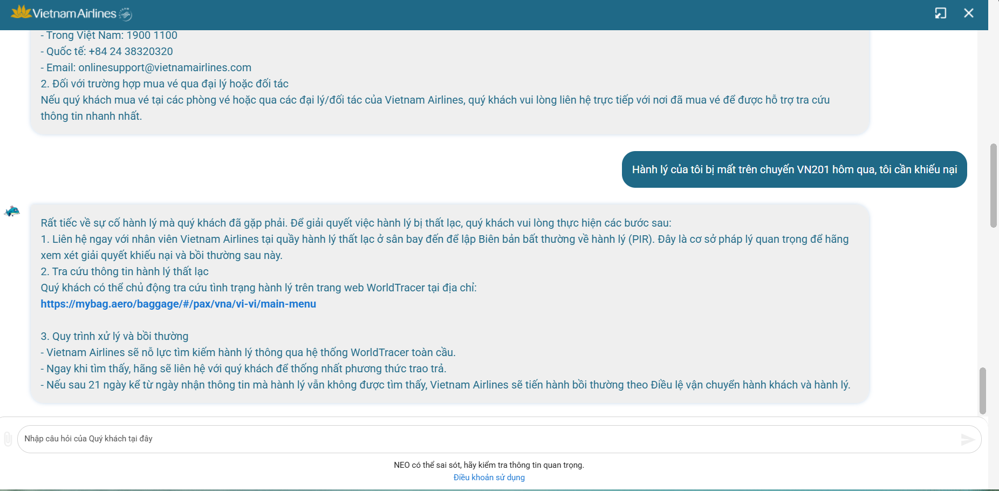

# Workshop — Mổ App AI Thật: NEO (Vietnam Airlines)

**Thời gian:** 35-45 phút  
**Hình thức:** cá nhân trước, chia sẻ theo nhóm sau  
**Output:** finding note + sketch `as-is / to-be`

Mục tiêu không phải chấm "UI đẹp hay xấu". Mục tiêu là dùng sản phẩm thật như một bài needfinding: tìm chỗ product gãy trong workflow thật, rồi viết finding đó thành quyết định product.

---

## 1. Chọn một sản phẩm để dùng thử

**Sản phẩm đã chọn:** Vietnam Airlines — **NEO**  
**AI feature:** Chatbot hỗ trợ vé, hành lý, khiếu nại, tra cứu chuyến bay  

---

## 2. Dùng thử: promise vs reality

### Promise (Hứa hẹn)
- NEO hứa là "trợ lý 24/7" giúp hành khách xử lý toàn bộ hành trình: từ tra cứu chuyến bay, đặt vé, hành lý, check-in, đến khiếu nại và bồi thường.

### User được hứa sẽ được giúp
- Hành khách đang gặp sự cố (delay, mất hành lý, hủy vé).
- Người muốn tra cứu nhanh mà không muốn gọi hotline 1900 1100.
- Traveler lần đầu cần hướng dẫn thủ tục check-in, hành lý ký gửi.

### Kỳ vọng AI làm được task nào?
| Task kỳ vọng | Kết quả thực tế |
|---|---|
| Tra cứu lịch bay HAN → SGN ngày mai | ✅ Hoạt động — redirect link tìm chuyến |
| Kiểm tra quy định hành lý xách tay | ✅ Trả thông tin chuẩn từ policy |
| Hỏi: "Vé tôi bị hoàn chưa?" (cụ thể) | ❌ Không truy được booking cá nhân, chỉ đưa link chung |
| Khiếu nại: "Hành lý tôi bị mất chuyến VN201" | ❌ Chatbot loop — không khai thác được chi tiết, không mở ticket |
| Hỏi mơ hồ: "Bay mùa hè đi đâu rẻ nhất?" | ❌ Trả về danh sách generic, không hỏi lại context (ngân sách, điểm đi) |

### Điểm gãy xuất hiện ở đâu?
**Điểm gãy chính:** Khi user chuyển từ tra cứu thông tin chung → giải quyết vấn đề cá nhân cụ thể, NEO không có khả năng truy vấn booking thực tế và không có flow dẫn dắt rõ ràng để escalate sang agent người thật.

**Evidence quan sát:**
- Khi nhập "tôi muốn khiếu nại hành lý bị mất", NEO trả ra link FAQ chung về quy trình — không hỏi thêm số booking, ngày bay, hoặc loại sự cố.
- Khi thử input mơ hồ ("chuyến bay bị delay thì sao?"), bot cho câu trả lời generic về chính sách delay — không hỏi "bạn đang ở chuyến bay nào?" để cá nhân hóa.
- Không có bất kỳ low-confidence signal nào ("Tôi không chắc — bạn có muốn gặp agent không?"). Bot trả lời confident nhưng sai context.

**Screenshot / observation:**


---

## 3. Vẽ 4 paths

| Path | Câu hỏi | Quan sát thực tế NEO |
|---|---|---|
| **Happy** | Khi AI đúng và tự tin, user thấy gì? | Hoạt động tốt với câu hỏi policy chuẩn (hành lý, check-in time). User nhận được thông tin đúng, có link chi tiết. UX đủ dùng. |
| **Low-confidence** | Khi AI không chắc, hệ thống có hỏi lại, show options hoặc chuyển người không? | **THIẾU.** NEO không có cơ chế thể hiện uncertainty. Bot trả lời confident kể cả khi input mơ hồ hoặc ngoài scope. Không có "Bạn có thể nói rõ hơn không?" hay "Tôi không chắc, để tôi chuyển cho agent". |
| **Failure** | Khi AI sai, user biết bằng cách nào và sửa thế nào? | **Rất yếu.** Khi bot trả sai (vd: policy hành lý cũ so với version mới), user không có cách biết. Không có "Thông tin này có giúp ích không?". User chỉ biết bot sai khi gọi hotline và được agent nói khác. |
| **Correction** | Khi user sửa, correction có được lưu/học lại không hay biến mất? | **Không tồn tại.** Nếu user nói "Câu trả lời này không đúng", bot không ghi nhận, không log, không route sang agent. Hội thoại reset hoặc loop lại menu chính. |

**Kết luận 4 paths:** NEO chỉ có **Happy path** hoạt động ổn. Ba path còn lại (Low-confidence, Failure, Correction) hầu như không được thiết kế.

---

## 4. Viết finding thành quyết định

### Finding 1 — Intent mơ hồ không được xử lý

```
Khi user hỏi về vấn đề cá nhân cụ thể (khiếu nại hành lý, hoàn vé),
AI xử lý input như keyword tra cứu FAQ thay vì nhận ra đây là distress intent cần hành động,
hậu quả là user không nhận được hỗ trợ thực sự, phải gọi hotline bằng tay — 
trải nghiệm tệ hơn nếu không có chatbot.
Lỗi thuộc layer: Intent + UX Recovery.
Nên sửa bằng: intent classifier phân biệt "hỏi thông tin" vs "cần giải quyết sự cố";
với intent sự cố → bắt buộc collect booking reference trước khi trả lời,
hoặc route ngay sang live agent.
```

### Finding 2 — Không có low-confidence signal

```
Khi user hỏi câu mơ hồ ("Bay mùa hè đi đâu rẻ?", "Vé tôi thế nào rồi?"),
AI không nhận ra mình thiếu thông tin để trả lời chính xác,
hậu quả là bot trả lời confident nhưng generic — user tin theo rồi thất vọng khi thực tế khác.
Lỗi thuộc layer: Promise + Low-confidence path.
Nên sửa bằng: confidence threshold — nếu input thiếu context key (ngày bay, booking ID, điểm đi),
bot phải hỏi lại tối đa 2 câu trước khi trả lời.
```

### Finding 3 — Không có Correction path

```
Khi user nói câu trả lời của bot không đúng hoặc không giúp được,
bot không có cơ chế nhận feedback, không mở escalation path, không log sự cố,
hậu quả là user bỏ cuộc hoặc gọi hotline — bot không học và vấn đề tái diễn.
Lỗi thuộc layer: UX Recovery + Safety.
Nên sửa bằng: thumbs down / "Câu trả lời này không giúp được" → trigger escalation flow
(offer live agent, mở ticket tự động, hoặc ít nhất log case ID để agent follow up).
```

---

## 5. Sketch as-is / to-be

### As-is flow (hiện tại — NEO)

```
User có vấn đề khiếu nại hành lý
        │
        ▼
Mở chatbot NEO → Nhập: "Hành lý bị mất chuyến VN201"
        │
        ▼
NEO nhận keyword "hành lý" → Tra FAQ
        │
        ▼
NEO trả: "Xem quy trình tại [link]" + "Gọi 1900 1100"   ← ĐIỂM GÃY
        │
        ▼
User không có thêm thông tin hữu ích
        │
        ▼
User thoát chatbot → Gọi hotline (tốn thêm 10–20 phút)
```

**Điểm gãy đánh dấu:**  Sau bước NEO trả về link FAQ — bot không hỏi thêm, không escalate, không tạo ticket.

---

### To-be flow (đề xuất)

```
User có vấn đề khiếu nại hành lý
        │
        ▼
Mở chatbot NEO → Nhập: "Hành lý bị mất chuyến VN201"
        │
        ▼
Intent classifier: "distress / complaint intent" detected
        │
        ▼
NEO hỏi collect: "Bạn cho tôi biết: (1) Mã booking? (2) Ngày bay? (3) Loại sự cố?"
        │
        ▼
[Nếu user cung cấp đủ] → NEO tạo case ticket, gửi confirmation email/SMS
[Nếu thiếu] → NEO hỏi lại tối đa 1 lần nữa, sau đó offer live agent
        │
        ▼
NEO: "Tôi đã ghi nhận case #XXXX. Agent sẽ liên hệ bạn trong 2 giờ.
      Bạn có muốn nói chuyện với agent ngay không?"   ← LOW-CONFIDENCE HANDLED
        │
        ▼
[Nếu user nói "sai" / "không đúng"] → NEO: "Xin lỗi, tôi sẽ chuyển cho agent ngay"
→ Route sang live agent + log conversation context   ← CORRECTION HANDLED
```

**Path đã sửa:**
- Low-confidence: NEO hỏi lại trước khi trả lời
- Failure/Correction: User có thể trigger escalation rõ ràng
- Happy path vẫn giữ nguyên cho FAQ thông thường
