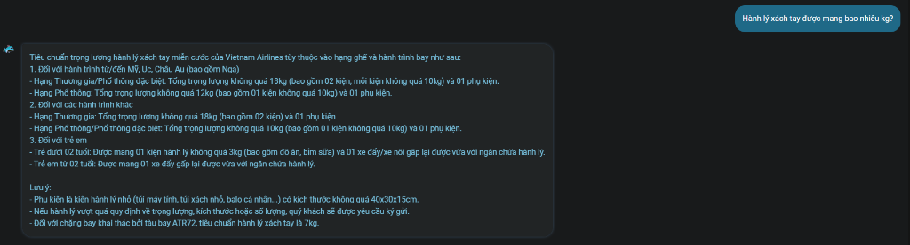
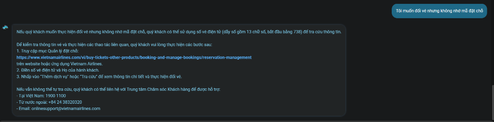
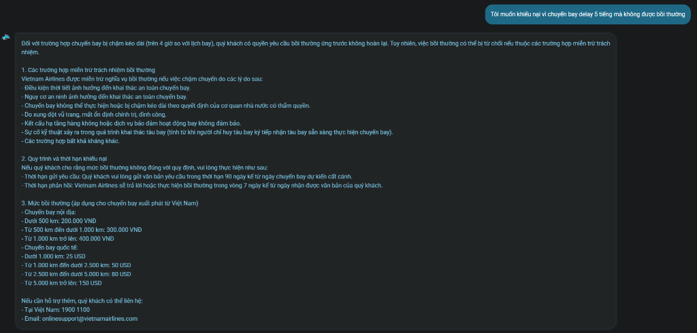
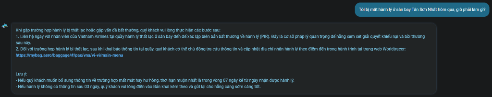
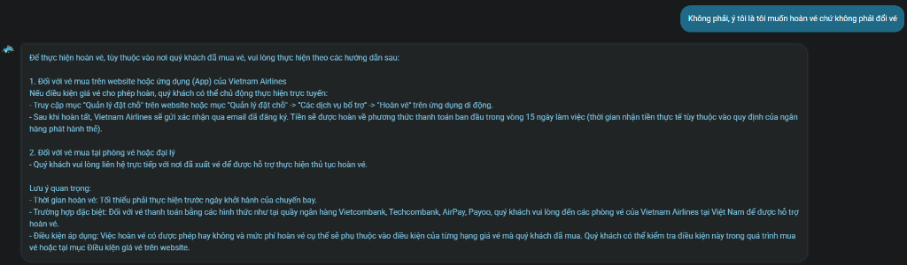
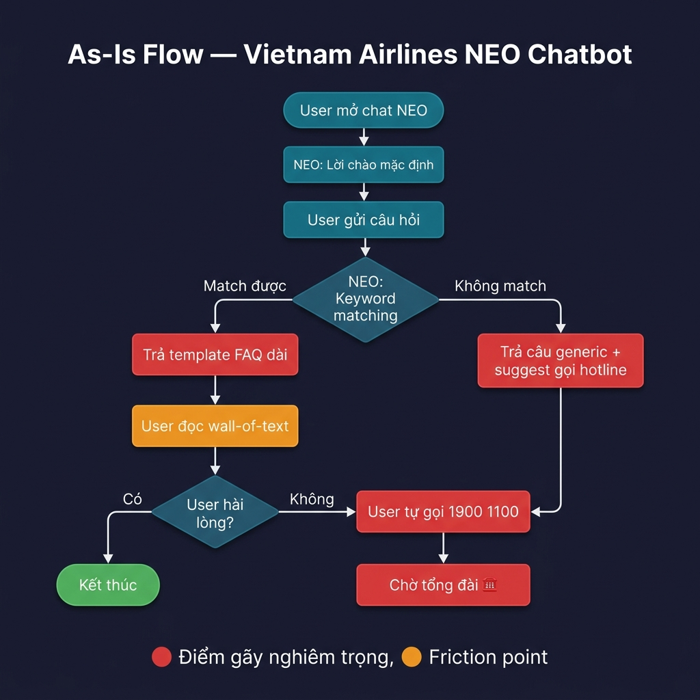
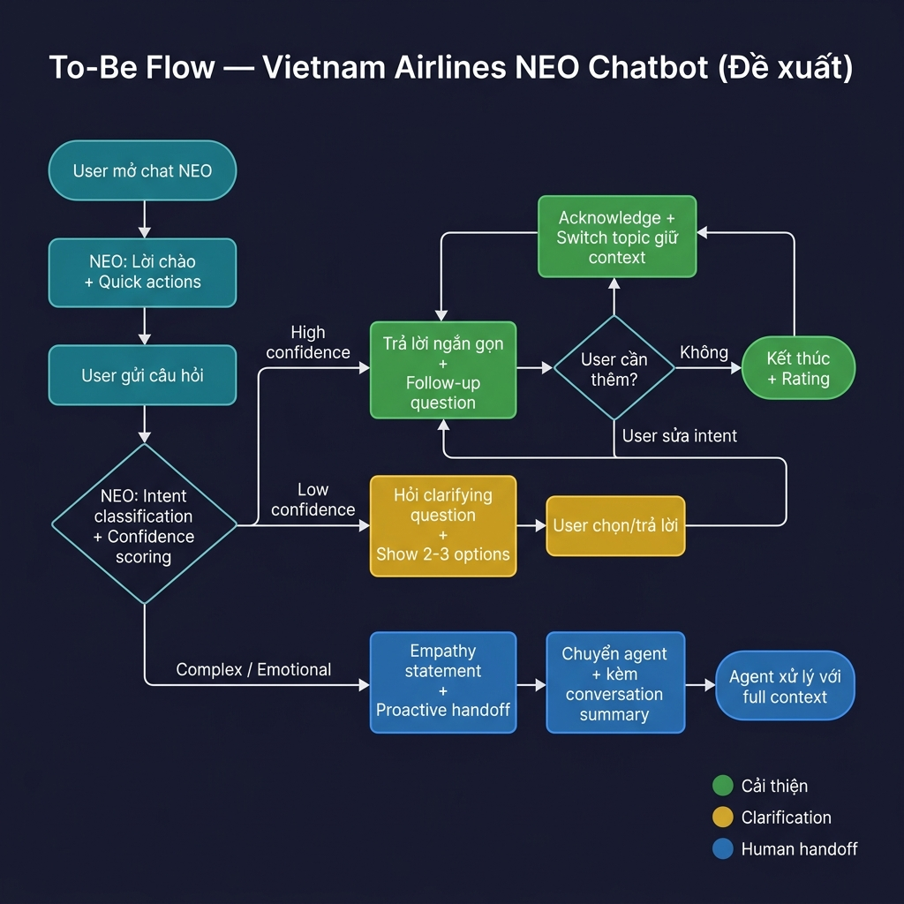

# Workshop — Mổ App AI: Vietnam Airlines NEO

**Sản phẩm:** Vietnam Airlines — NEO (Chatbot trợ lý ảo)  
**Kênh truy cập:** Website vietnamairlines.com  
**Ngày thực hiện:** 03/06/2026  

---

## 1. Sản phẩm đã chọn

| Sản phẩm | AI feature | Kênh |
|---|---|---|
| Vietnam Airlines — NEO | Chatbot hỗ trợ vé, hành lý, khiếu nại | Website VNA |

---

## 2. Dùng thử: Promise vs Reality

### Product hứa gì?

NEO được Vietnam Airlines quảng bá là **trợ lý ảo thông minh 24/7**, có khả năng:
- Tra cứu thông tin chuyến bay real-time
- Hỗ trợ đặt vé, quản lý đặt chỗ
- Giải đáp quy định hành lý, check-in, đổi/hoàn vé
- Xử lý khiếu nại
- Cá nhân hóa gợi ý dựa trên lịch sử hành vi

**User mục tiêu:** Hành khách VNA cần hỗ trợ nhanh mà không phải gọi tổng đài (1900 1100).

### Kỳ vọng AI làm được

- Hiểu câu hỏi tự nhiên, kể cả khi thiếu thông tin
- Hỏi lại khi không chắc chắn (low-confidence)
- Chuyển sang nhân viên khi vượt khả năng xử lý
- Ghi nhận và điều chỉnh khi user sửa lại intent

### Thực tế khi dùng — Điểm gãy

| Khía cạnh | Promise | Reality |
|---|---|---|
| Hiểu ngữ cảnh | "Trợ lý thông minh" | FAQ retrieval — match keyword, trả template |
| Hỏi lại khi không chắc | Có low-confidence path | **Không bao giờ hỏi lại** — luôn trả lời ngay |
| Chuyển người chủ động | Seamless handoff | Chỉ đưa số hotline/email ở cuối, không proactive |
| Cá nhân hóa | Phân tích hành vi | Không thấy bất kỳ cá nhân hóa nào |
| Xử lý khiếu nại | Hỗ trợ khiếu nại | Chỉ dump chính sách, không giúp file complaint |

---

## 3. Phân tích 4 Paths

### 🟢 Happy Path — "Hành lý xách tay được mang bao nhiêu kg?"



**Observation:**
- NEO trả lời **chính xác, chi tiết, có cấu trúc** — phân loại theo hạng ghế, hành trình, và đối tượng (trẻ em).
- Thông tin bao gồm cả lưu ý (kích thước phụ kiện, quy định ATR72).
- **Đánh giá:** ✅ Đây là trường hợp tốt nhất — câu hỏi FAQ đơn giản, NEO match đúng intent và trả lời đầy đủ.
- **Điểm tốt:** Response format rõ ràng, có bullet points, dễ scan.
- **Điểm yếu:** Không hỏi hành trình cụ thể để filter thông tin — dump hết tất cả trường hợp.

---

### 🟡 Low-confidence Path — "Tôi muốn đổi vé nhưng không nhớ mã đặt chỗ"



**Observation:**
- User nói rõ là **"không nhớ mã đặt chỗ"** — đây là signal rằng user đang thiếu thông tin và cần help recover.
- NEO **không hỏi lại** bất kỳ câu nào. Thay vào đó, đưa luôn hướng dẫn chung:
  - Gợi ý dùng số vé điện tử (13 chữ số, bắt đầu 738)
  - Đưa link Quản lý đặt chỗ
  - Cuối cùng đưa hotline/email
- **Đánh giá:** ⚠️ NEO **không có low-confidence behavior**. Nó không phân biệt giữa "user biết thông tin" vs "user không biết thông tin". Luôn trả lời cùng template.
- **Điểm gãy chính:** NEO có thể hỏi *"Quý khách có nhớ số vé điện tử hoặc email đặt vé không?"* — nhưng nó không làm điều này.

---

### 🔴 Failure Path

#### Case 1: "Tôi muốn khiếu nại vì chuyến bay delay 5 tiếng mà không được bồi thường"



**Observation:**
- User đang trong trạng thái **frustration cao** — chuyến bay delay 5 tiếng, chưa được bồi thường.
- NEO trả lời bằng **wall of text** dài gồm:
  - Quyền bồi thường cho delay >4 giờ
  - 8 trường hợp miễn trừ trách nhiệm
  - Quy trình khiếu nại và thời hạn
  - Bảng mức bồi thường chi tiết
- **Điểm gãy nghiêm trọng:**
  1. **Không empathy** — Không có câu nào như "Chúng tôi xin lỗi về trải nghiệm không tốt"
  2. **Information overload** — Dump toàn bộ chính sách thay vì guide từng bước
  3. **Không action** — Không giúp user file complaint, chỉ nói "gửi văn bản yêu cầu trong 90 ngày"
  4. **Không proactive escalation** — Không đề xuất chuyển sang agent để xử lý ngay
  5. Cuối chỉ ghi hotline/email — user phải tự làm hết

#### Case 2: "Tôi bị mất hành lý ở sân bay Tân Sơn Nhất hôm qua, giờ phải làm gì?"



**Observation:**
- User đang **khẩn cấp** — mất hành lý, cần hỗ trợ ngay.
- NEO đưa hướng dẫn hợp lý:
  - Liên hệ quầy hành lý thất lạc → lập PIR
  - Dùng WorldTracer để theo dõi
  - Lưu ý thời hạn 7 ngày
- **Điểm gãy:**
  1. **Không nhận biết urgency** — "hôm qua" nghĩa là user đã rời sân bay, không thể quay lại quầy.
  2. **Không hỏi thêm context** — Đã rời sân bay chưa? Đã lập PIR chưa?
  3. **Chỉ đưa generic flow** — Không adapt response cho tình huống cụ thể

---

### 🔵 Correction Path — "Không phải, ý tôi là tôi muốn hoàn vé chứ không phải đổi vé"



**Observation:**
- User sửa intent rõ ràng: *"Không phải đổi vé, ý tôi là hoàn vé"* — câu này vừa phủ định intent cũ, vừa đưa intent mới.
- NEO trả lời về quy trình hoàn vé — **nhưng đây không phải correction**, mà chỉ là **keyword matching lại từ đầu** với từ khóa "hoàn vé".
- **Đánh giá:** ⚠️ NEO **không có correction path thực sự**. Nó xử lý mỗi tin nhắn như một câu hỏi độc lập, không giữ context.
- **Bằng chứng NEO không "correct" mà chỉ "re-match":**
  1. **Không acknowledge lỗi** — Không hề nói "Xin lỗi, tôi hiểu nhầm" hay "Đã hiểu, quý khách muốn hoàn vé thay vì đổi vé"
  2. **Mất hoàn toàn context trước đó** — Ở câu trước user đã nói "không nhớ mã đặt chỗ", nhưng response hoàn vé lại yêu cầu truy cập "Quản lý đặt chỗ" — mâu thuẫn trực tiếp với context
  3. **Response giống hệt** nếu user hỏi "hoàn vé" ngay từ đầu — không có gì cho thấy NEO "học" từ câu trước
  4. **Không log/ghi nhận correction** — Không có dấu hiệu hệ thống biết intent trước đó bị sai
- **Kết luận:** NEO hoạt động như stateless FAQ — mỗi tin nhắn được xử lý riêng lẻ, không có memory, không có conversation flow thực sự. Correction path **không tồn tại** trong product này.

---

## 4. Findings → Product Decisions

### Finding 1: NEO thiếu Low-confidence Path

```text
Khi user hỏi "đổi vé nhưng không nhớ mã đặt chỗ",
AI trả lời template chung thay vì nhận ra user đang thiếu thông tin và cần guided recovery,
hậu quả là user phải tự tìm cách, hoặc bỏ cuộc gọi tổng đài.
Lỗi thuộc layer Intent + UX Recovery.
Nên sửa bằng low-confidence path: khi detect thiếu required input, 
hỏi lại "Quý khách có nhớ email đặt vé không?" → guide step-by-step 
thay vì dump template.
```

### Finding 2: Failure path không có empathy & proactive escalation

```text
Khi user khiếu nại "chuyến bay delay 5 tiếng, không được bồi thường",
AI dump wall-of-text chính sách bồi thường + 8 trường hợp miễn trừ,
hậu quả là user frustration tăng, cảm giác bị "đá" sang tự đọc policy.
Lỗi thuộc layer UX Recovery + Promise.
Nên sửa bằng:
  1. Mở đầu bằng empathy statement
  2. Hỏi mã đặt chỗ/số hiệu chuyến bay → lookup trạng thái cụ thể
  3. Nếu eligible bồi thường → guide file complaint ngay trong chat
  4. Nếu cần review → proactive chuyển agent kèm context
```

### Finding 3: NEO là FAQ retrieval, không phải conversational AI

```text
Khi user hỏi "mất hành lý ở Tân Sơn Nhất hôm qua",
AI trả lời "liên hệ quầy hành lý thất lạc ở sân bay" — bỏ qua context "hôm qua" = đã rời sân bay,
hậu quả là hướng dẫn không khả thi, user mất thời gian.
Lỗi thuộc layer Intent + Data-tool.
Nên sửa bằng context-aware routing:
  - Parse thời gian ("hôm qua") → skip bước "ra quầy sân bay"
  - Hỏi "Quý khách đã lập biên bản PIR chưa?" → branch flow
  - Nếu chưa → hướng dẫn gọi hotline sân bay cụ thể (TSN)
  - Nếu rồi → hướng dẫn WorldTracer + theo dõi
```

### Finding 4: Correction path không tồn tại — NEO là stateless

```text
Khi user sửa "không phải đổi vé, ý tôi là hoàn vé",
AI không thực sự "correct" — chỉ keyword-match lại từ đầu với "hoàn vé", 
bỏ qua toàn bộ context trước (user đã nói không nhớ mã đặt chỗ),
hậu quả là response hoàn vé yêu cầu "truy cập Quản lý đặt chỗ" — 
mâu thuẫn trực tiếp với thông tin user đã cung cấp, 
user mất tin tưởng vào khả năng "hiểu" của AI.
Lỗi thuộc layer Intent + UX Recovery + Data-tool.
Nên sửa bằng:
  - Thêm conversation memory: giữ context từ các tin nhắn trước
  - Acknowledge correction: "Đã hiểu, quý khách muốn hoàn vé thay vì đổi vé."
  - Sử dụng context: biết user không nhớ mã đặt chỗ → proactive 
    đưa alternative (số vé điện tử, email) thay vì yêu cầu mã đặt chỗ lần nữa
```

---

## 5. Sketch: As-Is / To-Be

### As-Is Flow (hiện tại) — đánh dấu điểm gãy



> **Điểm gãy (đỏ/cam):**
> - 🔴 Template FAQ dài — information overload, không filter theo context
> - 🔴 Generic fallback — không hỏi lại, không clarify
> - 🟠 Wall-of-text — user phải tự scan, tự extract action
> - 🔴 Tự gọi hotline — không proactive handoff, mất context

---

### To-Be Flow (đề xuất) — đã sửa các path



> **Cải thiện (xanh lá / xanh dương / vàng):**
> - 🟢 Response ngắn gọn + follow-up — tránh info overload
> - 🟡 Clarifying questions — low-confidence path thực sự
> - 🔵 Empathy + proactive handoff — cho case phức tạp/emotional
> - 🟢 Acknowledge correction — giữ context xuyên suốt conversation

---

## 6. Failure Mode — Lỗi nguy hiểm nhất

**Lỗi nguy hiểm nhất:** NEO dump chính sách bồi thường dài + liệt kê 8 trường hợp miễn trừ cho user đang frustration vì delay 5 tiếng.

**Vì sao nguy hiểm:**
- User đang emotional → nhận wall-of-text chính sách → frustration tăng gấp đôi
- Phần "miễn trừ trách nhiệm" khiến user cảm giác hãng đang tìm cách **né bồi thường** thay vì **giúp đỡ**
- Không có empathy, không proactive escalation → user mất tin tưởng vào cả brand VNA, không chỉ chatbot
- **Rủi ro reputational:** User có thể screenshot response này đăng lên mạng xã hội → PR crisis

**Cách prototype xử lý:**
- Khi detect intent "khiếu nại" + emotional keywords → mở đầu bằng empathy: *"Chúng tôi xin lỗi về trải nghiệm này."*
- Hỏi mã đặt chỗ / số hiệu chuyến bay → lookup trạng thái thực → trả lời cá nhân hóa
- Nếu eligible bồi thường → guide file complaint ngay trong chat (không yêu cầu user tự tìm)
- Nếu cần review phức tạp → **proactive chuyển agent** kèm conversation summary, không đẩy user đi gọi hotline

---

## 7. Build Slice

```text
Cho hành khách VNA đang cần hỗ trợ sau sự cố (delay/mất hành lý/đổi-hoàn vé),
prototype dùng AI để phân loại intent + confidence scoring + emotional detection,
tạo ra response cá nhân hóa (ngắn gọn, có follow-up question, giữ context),
và xử lý failure mode (user frustration + complex complaint) 
bằng empathy statement + proactive handoff sang agent kèm conversation summary.
```

---

## 8. Auto/Aug Decision

| Tình huống | Quyết định | Lý do |
|---|---|---|
| FAQ đơn giản (hành lý, check-in) | **Automate** — AI tự trả lời | Intent rõ, data có sẵn, risk thấp |
| User thiếu thông tin (không nhớ mã đặt chỗ) | **Augment** — AI hỏi clarifying question | Cần user input, AI guide nhưng không quyết thay |
| Khiếu nại / sự cố (delay, mất hành lý) | **Augment → Human handoff** | Emotional, cần empathy + xử lý case-by-case |
| Bồi thường / hoàn tiền | **Human quyết định** — AI chỉ collect info | Risk tài chính cao, cần human approval |

**Human giữ quyền ở đâu:**
- Mọi quyết định liên quan đến **tiền** (bồi thường, hoàn vé) → human approve
- Mọi case **emotional** (khiếu nại, sự cố) → human tiếp nhận sau khi AI collect context
- AI **không bao giờ** từ chối bồi thường hoặc nói "không đủ điều kiện" → chỉ human được quyết

---

## 9. Tự kiểm tra

- [x] Có ít nhất 1 screenshot hoặc observation cụ thể — **5 screenshots từ 5 queries thực tế**.
- [x] Có đủ 4 paths hoặc nói rõ path nào chưa có trong product — **Happy ✅, Low-confidence ⚠️ (không tồn tại), Failure ✅, Correction ⚠️ (không tồn tại — NEO stateless)**.
- [x] Finding được viết thành product decision, không chỉ là nhận xét — **4 findings cấu trúc đầy đủ**.
- [x] Sketch có as-is và to-be — **Flowchart images với điểm gãy đánh dấu**.
- [x] Có một câu nói rõ finding này sẽ đổi gì trong SPEC:

> **Thay đổi SPEC:** Bổ sung **Confidence Score threshold** trong intent classification — khi score < 0.7, bắt buộc trigger clarifying question thay vì trả template. Thêm **Emotional Detection layer** — khi detect keywords "khiếu nại / mất / delay / hư hỏng", auto-escalate sang agent với conversation context. Thêm **Conversation Memory** — giữ context xuyên suốt session để tránh mâu thuẫn giữa các response.

- [x] Failure mode — **Đã xác định lỗi nguy hiểm nhất + cách prototype xử lý**.
- [x] Build slice — **Đúng format: user + task + AI action + output + failure mitigation**.
- [x] Auto/Aug decision — **Đã phân loại rõ AI tự làm vs gợi ý vs human quyết định**.

