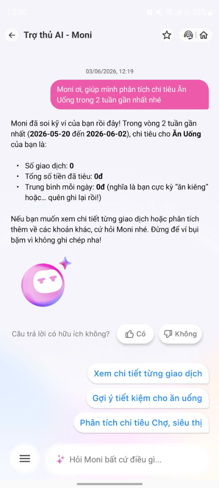
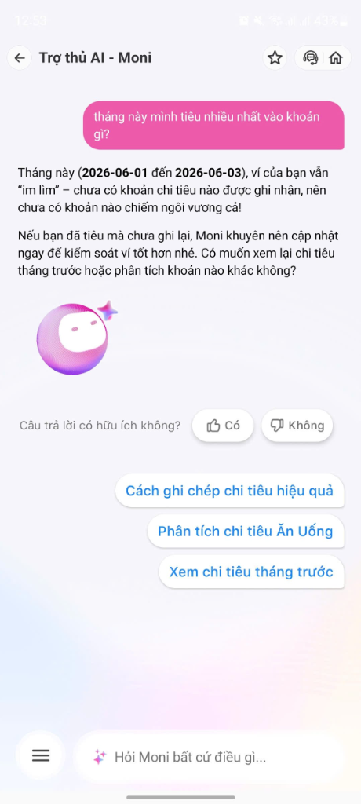
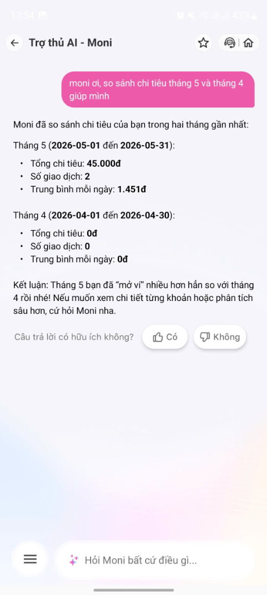
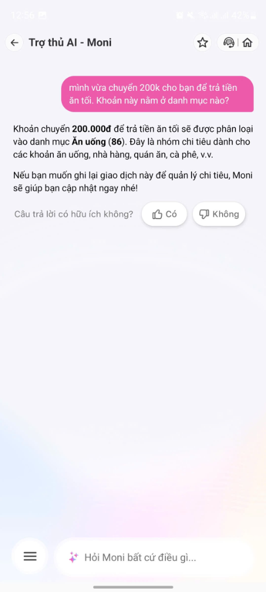
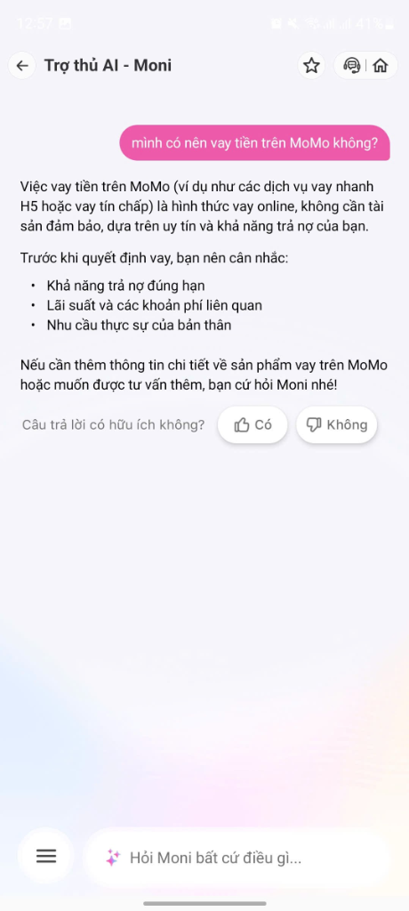
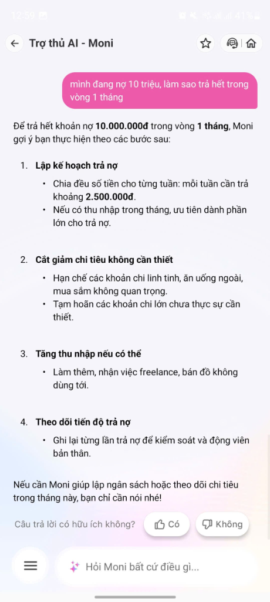
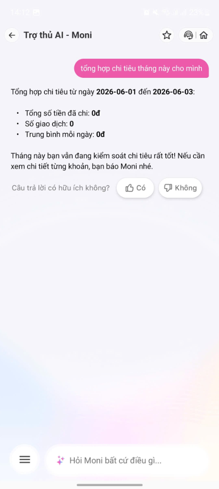

# Template — Evidence Pack

**Học viên:** Dương Đức Cường — 2A202600794  
**Ngày:** 03/06/2026

---

## 1. Nhóm và track

**Tên nhóm:** Cá nhân — Dương Đức Cường  
**Track:** Fintech / Quản lý tài chính cá nhân  
**Product/app đã chọn:** MoMo — Moni (Trợ thủ tài chính AI)  
**Build slice đang nghĩ:** Prototype cải thiện flow phân tích chi tiêu khi data MoMo thiếu — AI phát hiện khoảng trống bất thường, disclaimer nguồn dữ liệu, proactive hỏi user bổ sung, và KHÔNG đưa nhận xét đánh giá khi data không đủ.

---

## 2. Self-use evidence

Tự dùng app MoMo Moni với 8 câu hỏi test khác nhau, ghi lại điểm gãy.

| # | Observation | Screenshot | Path liên quan | Điều học được |
|---|---|---|---|---|
| 1 | Hỏi "phân tích chi tiêu Ăn Uống 2 tuần" → trả 0đ, 0 giao dịch. User ăn uống hàng ngày bằng tiền mặt/ngân hàng. Moni không disclaimer nguồn data. |  | **Failure** | Moni chỉ "thấy" giao dịch MoMo. Với user chi tiêu đa kênh, tính năng "trợ thủ tài chính" gần như vô nghĩa. |
| 2 | Hỏi "tháng này tiêu nhiều nhất khoản gì?" → trả 0đ, nhưng khuyên "nếu chưa ghi lại, nên cập nhật ngay" + gợi ý "Cách ghi chép chi tiêu hiệu quả". |  | **Low-confidence (tốt)** | Moni nhận ra data có thể thiếu và gợi ý bổ sung — hành vi tốt. Nhưng vẫn không disclaimer nguồn data. |
| 3 | Hỏi "so sánh chi tiêu tháng 5 và tháng 4" → Tháng 5: 45k (2 GD), Tháng 4: 0đ. Kết luận: "mở ví nhiều hơn hẳn". Thực tế user chi hàng triệu/tháng ngoài MoMo. |  | **Failure** | So sánh dựa trên data thiếu → kết luận hoàn toàn sai. Nguy hiểm nếu user tin và đưa quyết định tài chính dựa vào đây. |
| 4 | Hỏi "chuyển 200k cho bạn trả tiền ăn tối, danh mục nào?" → Moni phân loại **đúng** "Ăn uống (86)" vì user nói rõ context. |  | **Happy** | Moni hiểu context khi user nói rõ. Nhưng thực tế giao dịch chuyển tiền không có ghi chú sẽ bị phân loại sai → AI cần proactive hỏi mục đích. |
| 5 | Hỏi "có nên vay tiền trên MoMo không?" → Moni đưa 3 điểm cần cân nhắc (khả năng trả nợ, lãi suất, nhu cầu). Có disclaimer nhưng cuối cùng vẫn gợi ý "hỏi thêm về sản phẩm vay trên MoMo". |  | **Low-confidence** | Ranh giới tư vấn tài chính vs quảng bá sản phẩm mờ nhạt. Cần minh bạch hơn. |
| 6 | Hỏi "chi tiêu linh tinh là gì?" → Trả lời rõ ràng, cho ví dụ cụ thể, khuyên ghi chú từng khoản. |  | **Happy** | Moni xử lý tốt câu hỏi khái niệm/mơ hồ. Đây là điểm mạnh. |
| 7 | Hỏi "nợ 10 triệu, trả hết 1 tháng?" → Moni đưa 4 bước generic. KHÔNG dùng data chi tiêu cá nhân của user để cá nhân hoá. |  | **Failure** | Moni hứa "cá nhân hoá" nhưng lời khuyên generic — không khác Google search. |
| 8 | Hỏi "sửa giao dịch 50k hôm qua thành tiền ăn sáng" → Moni yêu cầu mã giao dịch, không tự tìm. |  | **Correction (gãy)** | Correction path quá phức tạp — user bỏ cuộc. AI nên tự tìm giao dịch khớp rồi hỏi xác nhận. |
| 9 | Hỏi "tổng hợp chi tiêu tháng này" → 0đ, 0 GD. Moni khen: "Kiểm soát chi tiêu rất tốt!" |  | **Failure (nguy hiểm)** | **False positive**: khen user khi data thiếu. Hành vi nguy hiểm nhất — user có thể tin và không biết mình đang chi tiêu quá tay. |

---

## 3. User / review / social evidence

Nguồn từ review App Store/Play, bài báo, trang hỗ trợ MoMo và forum cộng đồng.

| Quote / review / observation | Nguồn | User là ai? | Pain/failure mode |
|---|---|---|---|
| "Việc phân loại có thể gặp khó khăn với các giao dịch có nội dung không rõ ràng hoặc các khoản chi tiêu phức tạp ngoài hệ sinh thái MoMo." | momo.vn (trang hỗ trợ) | Người dùng MoMo nói chung | Failure — AI phân loại sai khi giao dịch thiếu context. Khớp với finding từ self-use. |
| "Giao dịch chuyển tiền thường không có thông tin chi tiết về đơn vị thụ hưởng, do đó AI khó nhận diện chính xác nếu bạn không đặt ghi chú." | momo.vn (hướng dẫn Quản lý chi tiêu) | User chuyển tiền cho bạn bè | Failure — phân loại sai do thiếu context ghi chú. Xác nhận self-use test #4. |
| "Nhiều người dùng đánh giá 1 sao do không hiểu rõ lý do bị trừ tiền, đặc biệt khi liên kết ví MoMo làm phương thức thanh toán cho Google Play/App Store." | Google Play reviews tổng hợp 2025-2026 | Người dùng trẻ liên kết ví | Failure — user confused bởi giao dịch tự động, Moni không giải thích rõ. |
| "Tích hợp quá nhiều dịch vụ, tính năng mới có thể khiến ứng dụng trở nên cồng kềnh, gây khó khăn cho người dùng mới hoặc những người không rành công nghệ." | Bài đánh giá tổng hợp MoMo 2025-2026 | Người dùng lớn tuổi / ít tech-savvy | Low-confidence — quá nhiều tính năng, user không biết Moni giúp gì. |

---

## 4. Competitor / analog evidence

| App / mô hình tham khảo | Họ xử lý task này thế nào? | Pattern học được | Có áp dụng trong 1 ngày không? |
|---|---|---|---|
| **Money Lover** (app quản lý chi tiêu VN) | Cho phép user tự nhập chi tiêu thủ công nhanh chóng, có reminder hàng ngày nhắc nhập. Phân loại theo danh mục do user chọn. | Proactive reminder + manual input flow đơn giản giúp data đầy đủ hơn. | Có — prototype thêm prompt nhắc nhập chi tiêu ngoài MoMo. |
| **Cleo AI** (fintech UK) | Chatbot AI phân tích chi tiêu. Khi data thiếu, Cleo nói rõ: "I can only see transactions from your linked accounts." và gợi ý liên kết thêm. | Disclaimer rõ ràng về nguồn dữ liệu + low-confidence path khi data thiếu. | Có — prototype thêm disclaimer tương tự. |
| **YNAB** (budgeting app) | Bắt buộc user ghi chép mọi giao dịch (kể cả tiền mặt). Khi thiếu giao dịch, app cảnh báo "uncleared transactions". | KHÔNG đưa nhận xét đánh giá khi data chưa đầy đủ. | Có — prototype KHÔNG khen/chê khi data thiếu. |

---

## 5. Evidence -> Insight

```text
Evidence nổi bật nhất:
1. Moni trả 0đ chi tiêu tháng và khen "kiểm soát chi tiêu rất tốt" (false positive).
2. So sánh 45k vs 0đ rồi kết luận "mở ví nhiều hơn" (kết luận sai).
3. Tư vấn trả nợ 10 triệu bằng lời khuyên generic, không dùng data cá nhân.
4. Yêu cầu mã giao dịch khi user muốn sửa phân loại (correction gãy).
5. Hành vi không nhất quán: cùng data 0đ nhưng lúc khuyên ghi chép, lúc khen.

Insight:
User trẻ Việt Nam chi tiêu đa kênh không chỉ cần một chatbot phân tích chi tiêu.
Họ thật ra cần một trợ thủ tài chính BIẾT RÕ GIỚI HẠN CỦA MÌNH:
  - Biết khi nào data thiếu và nói thật cho user,
  - Không đưa nhận xét đánh giá khi chưa đủ cơ sở,
  - Dùng data có để cá nhân hoá lời khuyên thay vì trả generic,
  - Cho phép user sửa lỗi dễ dàng ngay trong trải nghiệm chat.

Vấn đề cốt lõi không phải AI "ngu" — Moni khá thông minh trong phạm vi data có.
Vấn đề là AI "mù" và "không trung thực về sự mù" — nó không biết data thiếu
và không nói cho user biết, thậm chí còn đưa nhận xét tích cực sai lệch.

Opportunity:
AI có thể giúp bằng cách phát hiện khoảng trống bất thường trong dữ liệu,
disclaimer rõ ràng ở mọi kết quả phân tích,
proactive hỏi user bổ sung chi tiêu ngoài MoMo,
và TUYỆT ĐỐI KHÔNG đưa nhận xét đánh giá khi data không đủ cơ sở.
```

---

## 6. Evidence đổi SPEC như thế nào?

- [ ] Đổi user chính.
- [x] Đổi pain statement. → Pain không phải "AI phân tích sai" mà là "AI không biết data thiếu và đưa nhận xét sai lệch (false positive)."
- [x] Đổi build slice. → Thêm 3 tính năng: (1) disclaimer nguồn data, (2) phát hiện khoảng trống + hỏi bổ sung, (3) KHÔNG đưa nhận xét đánh giá khi data thiếu.
- [x] Đổi Auto/Aug decision. → Giữ Augmentation: AI gợi ý + hỏi user xác nhận.
- [x] Đổi 4 paths. → Thêm low-confidence path nhất quán khi data thiếu. Sửa correction path: AI tự tìm giao dịch khớp.
- [x] Đổi failure mode. → Failure chính = false positive (khen "kiểm soát tốt" khi 0đ) thay vì chỉ "trả kết quả thiếu".
- [x] Đổi owner/test plan. → Thêm test case: false positive, so sánh data thiếu, correction flow.

Ghi rõ 1-2 thay đổi quan trọng:

```text
Trước evidence, nhóm định focus vào "AI trả kết quả thiếu, cần disclaimer".
Sau evidence (test 8 câu), nhóm phát hiện vấn đề NGHIÊM TRỌNG HƠN:
  AI không chỉ trả kết quả thiếu mà còn ĐƯA NHẬN XÉT ĐÁNH GIÁ SAI LỆCH
  ("kiểm soát chi tiêu rất tốt") dựa trên data thiếu → false positive nguy hiểm.
  Ngoài ra, hành vi không nhất quán (cùng data 0đ: lúc khuyên ghi chép, lúc khen)
  cho thấy thiếu safety rule thống nhất.
Lý do: False positive nguy hiểm hơn "trả 0đ" vì user có thể TIN và ĐƯA QUYẾT ĐỊNH
  tài chính sai (nghĩ mình chi tiêu ít → chi tiêu thêm → nợ).
```
